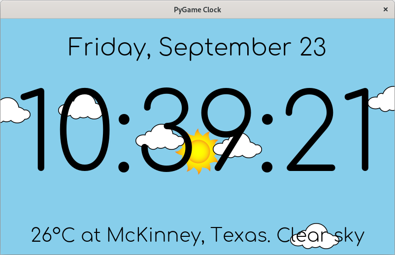
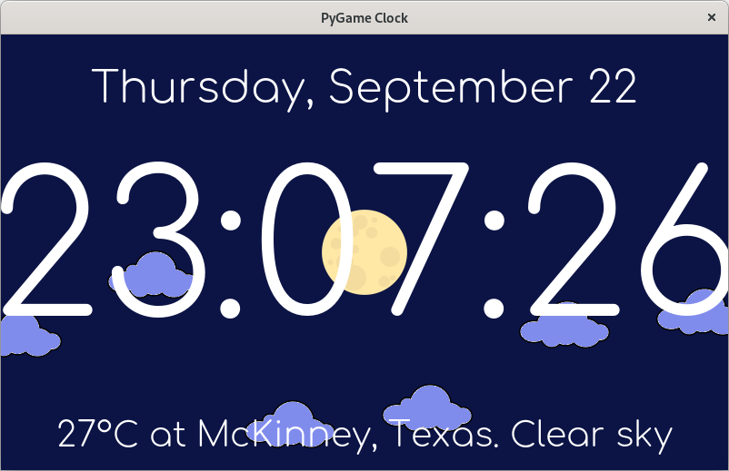

# pygame_clock
**_pygame_clock_ is a simple clock that features an animated background.**

pygame_clock shows the weather by querying [OpenWeather](https://openweathermap.org/).
By default, it gets the location where it is running via IP by querying [ipinfo.io](https://ipinfo.io/).
However, you can provide in the configuration file the latitude and longitude
of the desired location (See below).

It can be used fullscreen (the default) or windowed. You can choose between two
possible display modes: Show photos according to the weather or show an animated
background (the default).

When using it in animated-background mode, it creates clouds, rain, and 
snow using sprites. The sun and moon go up and down depending of the hour 
of the day and the sky changes its color depending if it is day or night.

## Configuration

The configuration is done via the `config/pygame_clock.json` file.

The default settings were originally tested with [Raspberry Pi 4 Model B](https://www.raspberrypi.com/products/raspberry-pi-4-model-b/)
running [Raspbian](https://www.raspberrypi.com/software/); however, pygame_clock can be run on all the platforms that support
[pygame](https://www.pygame.org/) >= 1.9, [pyowm](https://pyowm.readthedocs.io/) >= 3.0,
and [GeoPy](https://geopy.readthedocs.io/en/stable/) >= 2.1.0 with the provided settings.

All the settings are optional; however, it is recommended to have a configuration
file with at least your `api_key` setting, as the default provided key does not work:

```json
{
  "api_key": "Your OpenWeather API key"
}
```

The following settings are supported:

Setting             | Default     | Description
--------------------|-------------|------------
fullscreen          | 1           | Sets the mode between fullscreen (1) or windowed (0)
use_photos          | 0           | Choose between using photos to show the weather (1) or an animated background (0)
screen_width        | 800         | Width of screen when windowed
screen_height       | 480         | Height of screen when windowed
bg_color            |[0,0,0]      | Background color when in photo mode. This is visible only when no photo exists.
clock_font          |quicksand    | Font used for displaying text
time_face_percent   |45           | Percentage of screen used by the time text
date_face_percent   |10           | Percentage of screen used by date text
weather_face_percent|8            | Percentage of screen used by weather text
day_text_color      |[0,0,0]      | Text color using during day
night_text_color    |[255,255,255]| Text color using during night
time_format         | %H:%M:%S    | Time format in [strftime](https://strftime.org/) format
date_format         | %A, %B %d   | Date format in [strftime](https://strftime.org/) format
temperature_units   | celsius     | Temperature units. Can be chosen between _celsius_, _fahrenheit_ or _kelvin_
api_key             | xxxxxxxxxxx | OpenWeather API Key
queries_per_minute  | 2           | Times to query the OpenWeather API per minute
day_color           |[135,206,235]| Color of the sky during day when using animated background
night_color         |[12,20,69]   | Color of the sky during night when using animated background
cloud_speed         |0.1          | Cloud speed in pixels/update when using animated background. Adjust the value according to your system.
minimum_percent_of_last_cloud|5   | Minumum percent shown of the last cloud created before creating a new cloud when using animated background
raindrop_speed      | 15          | Raindrop falling speed in pixels/update when using animated background. Adjust the value according to your system.
snowflake_speed     | 1           | Snowflake falling speed in pixels/update when using animated background. Adjust the value according to your system.
latitude            |             | If provided, will force the latitude for clock's location
longitude           |             | If provided, will force the longitude for clock's location

## Requirements

[pygame](https://www.pygame.org/) for python3 >= 1.9, [pyowm](https://pyowm.readthedocs.io/) >= 3.0,
and [GeoPy](https://geopy.readthedocs.io/en/stable/) >= 2.1.0
## Images

The directory `images/` should contain the images that are used by the clock.
The following images are required:

**Animated Background Mode**
Filename       | Recommended size | Description
---------------|------------------|------------
sun.png        | 100x100          | Sun (included in the repo)
moon.png       | 100x100          | Moon (included in the repo)
cloud_day.png  | 100x60           | Cloud during day (included in the repo)
cloud_night.png| 100x60           | Cloud during night (included in the repo)
raindrop.png   | 25x50            | Single rain drop (included in the repo)
snowflake.png  | 50x50            | Single snowflake (included in the repo)

**Photo Mode**
_NOTE: None of these files are provided with the repo_
Filename            | Description
--------------------|------------------------
clear_day.png       | Clear sky during day
clear_night.png     | Clear sky during night
clouds_day.png      | Cloudy sky during day
clouds_night.png    | Cloudy sky during night
fog_day.png         | Foggy weather during day
fog_night.png       | Foggy weather during night
haze_day.png        | Hazy weather during day
haze_night.png      | Hazy weather during night
hurricane_day.png   | Hurricane during day
hurricane_night.png | Hurricane during night
mist_day.png        | Misty weather during day
mist_night.png      | Misty weather during night
rain_day.png        | Rainy weather during day
rain_night.png      | Rainy weather during day
snow_day.png        | Snowy weather during day
snow_night.png      | Snowy weather during day
storm_day.png       | Storm during day
storm_night.png     | Storm during night
tornado_day.png     | Tornado during day
tornado_night.png   | Tornado during night

_It is recommended that the size of the images in photo mode matches the resolution_
_of your screen_

## Usage

Before the first use, get a free openweather API key at [OpenWeather](https://home.openweathermap.org/users/sign_up)
and add it to the configuration file `config/pygame_clock.json`

Start the clock by running `pygame_clock.py`:
```shell
$ ./pygame_clock.py
```

To exit from the clock, press the `Esc` key or the `q` key.